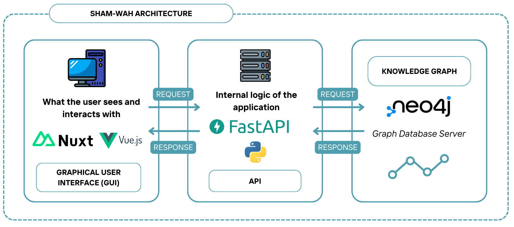
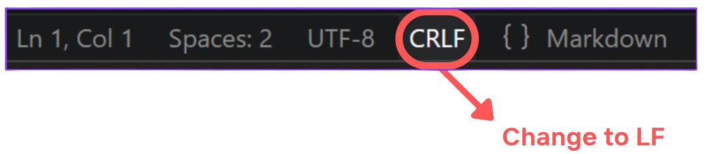

# 🐐 Sham-Wah 🐐


## ⛰️ About ⛰️

Sham‑Wah is a web application currently being developed for the [IntForOut Project](https://www.umr-lastig.fr/intforout/).
It provides an intuitive interface for sharing and browsing the wide range of resources (scientific papers, datasets, scripts, services, etc...) produced and used by the project’s research teams thanks to an architecture based on a knowledge graph called [OutdoorPressure](https://github.com/intforout/outdoorpressure).

## 🤔 Why the Name “Sham‑Wah”? 🤔

I wanted a short, pleasant‑sounding name for a Knowledge Graph Query Framework, ideally with a nod to knowledge graph, querying and alpine ecology. Since the project focuses on wildlife disturbance in mountain environments, I explored animal‑themed names and naturally thought of the [chamois](https://en.wikipedia.org/wiki/Chamois), an animal I love.

While searching for inspiration, I found an English [forum](https://www.facebook.com/groups/waywordradio/posts/10158351484663584/) discussing how to pronounce chamois. Someone wrote it as “sham‑wah”, and it immediately clicked: unique spelling, easy to pronounce, and a subtle reference to the real animal. During my research I discovered that chamois is also an [HTML color](https://encycolorpedia.fr/d0c07a) name, which inspired the color theme used in the app.

And that’s how Sham‑Wah was born.

## 📖 Table of contents 📖

- [Architecture Overview](#architecture-overview)
- [Installation](#installation)
- [Features](#features)
<!-- - [User guide](#user-guide) -->

<h2 id="architecture-overview">🏛️ Architecture Overview 🏛️</h2>

Sham‑Wah follows a web-based client–server architecture composed of three main components:

- Graphical User interface (GUI): a Nuxt‑based frontend for exploring the knowledge graph, running queries, and visualizing results
- API Backend: a FastAPI server that handles requests and communicates with the knowledge graph.
- Knowledge Graph Database: A Neo4j instance storing entities and relationships, enriched with the neosemantics plugin.

<p align='center' style="margin-top: 20px;">

</p>

### Try the Demo (GUI Only)

A static preview of the GUI is available here: https://intforout.github.io/sham-wah/explore/

This version does not communicate with the API or the Neo4j database, only the hard-coded data will give you a preview od the visualization of features.

<h2 id="installation">⚙️ Installation ⚙️</h2>

### 🐣 First steps 🐣

1. Clone the repository

```bash
git clone https://github.com/intforout/sham-wah.git
cd sham-wah
```

2. Each component (gui, api, neo4j) contains a .env.example. Create your .env files based on these templates:

```bash
cd gui
cp .env.example .env
```

3. Repeat for api and neo4j. Then choose your installation method.

### 🎭 Installation Options 🎭

You can run Sham‑Wah in two ways:

- [Using Docker](#docker) (recommended, easiest way)
- [Traditional installation](docs/guide-installation.md) (manual setup of GUI, API, and Neo4j)

<h2 id="docker">🐳 Docker Installation (Recommended) 🐳</h2>

1. Install Docker (or Docker Desktop on Windows).

2. Run all services:

```bash
docker compose up -d
```

#### Common issue on Windows

<div style="border-left: 4px solid #d9534f; padding: 0.8em;">
<strong>⚠️ WARNING</strong><br>
Neo4j container may fail to start if files use CRLF line endings. Configure your editor to use LF to avoid this issue.
</div>

<figure style="text-align: left; margin-top: 20px;">
  
  <figcaption style="margin-bottom: 8px; font-style: italic;">
    Screenshot of the bottom‑right corner of the VS Code editor
  </figcaption>
</figure>

- Then, re‑run the entire Docker Compose setup with:

```bash
docker compose build --no-cache
docker compose up -d
```

### 🪐 Services available 🪐

- GUI: http://localhost:3000/sham-wah/explore
- API Documentation (Swagger): http://localhost:8000/docs

<h2 id="features">🐥 Features 🐥</h2>

### 🚧 Work in Progress 🚧

The current version includes:

- A prototype layout with:
  - A query panel on the left that includes:
    - A predefined query panel highlighting digital assets linked to human activities
    - A panel with hard coded data for demonstration purposes
  - A graph neighborhood view on the right

More features will be added as development continues. You can also follow progress on the [github's project](https://github.com/users/vanou-suerte/projects/5)
